<div align="center">

# 🚀 Learning Logs - Full Stack Web Development 

### _Learn Web Development in Hinglish - Because code bhi apni language mein samajh aata hai!_ 💡

[](https://github.com/Pritamx4/learning-logs)
[](https://github.com/Pritamx4/learning-logs)
[](https://github.com/Pritamx4/learning-logs)
[](https://github.com/Pritamx4/learning-logs)

**🎯 Zero to Hero in Web Development | 📚 Complete Tutorials | 💻 Production-Ready Code**

[Quick Start](#-quick-start) • [Features](#-features) • [Learning Path](#-learning-path) • [Tech Stack](#-tech-stack)

---

</div>

## 🌟 Why This Project is Different?

> **"Programming seekhna mushkil nahi hai, bas samjhane ka tarika sahi hona chahiye!"**

### 💎 Unique Features:

- **🇮🇳 Hinglish Comments** - Har line samjhaya gaya hai in your language!
- **🎨 Professional Code Structure** - Industry standards follow karte hue
- **🔥 Interactive Examples** - Sirf theory nahi, live demos bhi!
- **⚡ Modern Best Practices** - Separation of concerns, clean architecture
- **🚀 Production Ready** - Copy-paste karo aur deploy karo!
- **📱 Responsive Design** - Mobile se lekar desktop tak perfect!

---

## 📂 Project Structure

```
learning-logs/
│
├── 📁 backend/                    # Node.js + Express Backend
│   ├── 01-express-basics.js       # Express fundamentals (Routes, Methods)
│   ├── 02-html-form-input.js      # Form handling with static files
│   ├── 03-middlewares.js          # Middleware chain explained
│   ├── 04-cookie-parser.js        # Session management
│   ├── 05-file-system.js          # File operations (CRUD)
│   ├── 06-auth-middleware.js      # Authentication + Authorization
│   ├── 07-router-middleware.js    # Modular routing
│   ├── public/                    # Static HTML forms
│   │   ├── index.html
│   │   ├── registration.html
│   │   └── login.html
│   ├── package.json
│   └── README.md
│
├── 📁 frontend/                   # HTML + CSS + JavaScript
│   ├── 📄 index.html              # Landing page with navigation
│   ├── 01-html-basics.html        # Complete HTML tutorial
│   ├── 02-css-basics.html         # CSS from basics to advanced
│   ├── 03-javascript-basics.html  # JS + DOM + Events
│   │
│   ├── 📁 css/                    # External stylesheets (Professional!)
│   │   ├── index.css              # Landing page styles
│   │   ├── 01-html.css            # HTML tutorial page styles
│   │   ├── 02-css.css             # CSS tutorial page styles
│   │   └── 03-javascript.css      # JS tutorial page styles
│   │
│   ├── 📁 js/                     # External JavaScript files
│   │   └── 03-javascript.js       # All interactive functions
│   │
│   └── README.md
│
└── 📄 README.md                   # You are here! 👋
```

---

## 🎯 What You'll Learn

<table>
<tr>
<td width="50%">

### 🎨 **Frontend Mastery**

- ✅ **HTML5** - Structure, Forms, Semantic Tags
- ✅ **CSS3** - Flexbox, Grid, Animations, Responsive
- ✅ **JavaScript ES6+** - Modern syntax, Arrow functions
- ✅ **DOM Manipulation** - Real-world examples
- ✅ **Event Handling** - Interactive web apps
- ✅ **Best Practices** - Clean, maintainable code

**📚 Topics Covered:**
- Variables, Data Types, Operators
- Functions, Arrays, Objects
- Loops, Conditionals
- Event Listeners (Click, Input, Hover, etc.)
- 4 Mini Projects (Counter, Todo, Color Changer, etc.)

</td>
<td width="50%">

### ⚙️ **Backend Excellence**

- ✅ **Node.js** - JavaScript on server
- ✅ **Express.js** - REST API development
- ✅ **Routing** - GET, POST, PUT, DELETE
- ✅ **Middleware** - Request/Response pipeline
- ✅ **Authentication** - Role-based access
- ✅ **File System** - File operations

**📚 Topics Covered:**
- Server setup and configuration
- Route handling and parameters
- Form data processing
- Cookie management
- Authentication & Authorization
- Modular code architecture

</td>
</tr>
</table>

---

## 🚀 Quick Start

### 📋 Prerequisites

```bash
# Node.js installed? Check karo:
node --version  # v14+ chahiye

# Git installed? Check karo:
git --version
```

### 💻 Installation & Setup

```bash
# 1️⃣ Clone the repository
git clone https://github.com/Pritamx4/learning-logs.git
cd learning-logs

# 2️⃣ Backend Setup
cd backend
npm install              # Dependencies install karo
npm run express          # Express basics chalao (Port 3000)
npm run form            # Form demo (Port 3001)
npm run cookie          # Cookie demo (Port 3003)
# ... aur bhi bahut saare!

# 3️⃣ Frontend Setup
cd ../frontend
# Simply HTML files ko browser me kholo:
# - Double click on index.html
# - OR use VS Code Live Server extension
# - OR open directly in browser
```

---

## 🎓 Learning Path

### 📌 **Recommended Order:**

```mermaid
graph LR
    A[📝 HTML Basics] --> B[🎨 CSS Basics]
    B --> C[⚡ JavaScript Basics]
    C --> D[🔙 Express Basics]
    D --> E[📋 Form Handling]
    E --> F[🔌 Middlewares]
    F --> G[🍪 Cookies]
    G --> H[📁 File System]
    H --> I[🔐 Authentication]
    I --> J[🛣️ Router]
    
    style A fill:#ff6b6b
    style B fill:#4ecdc4
    style C fill:#ffe66d
    style D fill:#a8e6cf
    style E fill:#ff8b94
    style F fill:#c7ceea
    style G fill:#ffd3b6
    style H fill:#98ddca
    style I fill:#d4a5a5
    style J fill:#9896e4
```



### 🕐 **Time Investment:**

| Module | Duration | Difficulty |
|--------|----------|------------|
| 🎨 Frontend Basics | 6-8 hours | 🟢 Easy |
| ⚙️ Backend Basics | 8-10 hours | 🟡 Medium |
| 🚀 Full Integration | 4-6 hours | 🟠 Advanced |
| **Total** | **18-24 hours** | **Worth It!** ✨ |

---

## 🛠️ Tech Stack

<div align="center">

### Frontend


### Backend


### Tools & Best Practices


</div>

---

## 🔥 Features in Action

### 🎨 **Frontend Tutorials**

- **Interactive Landing Page** - Beautiful cards with hover effects
- **HTML Tutorial** - 12+ sections with live examples
- **CSS Tutorial** - 15+ topics with animations and transitions
- **JavaScript Tutorial** - Event listeners + 4 mini projects

### ⚡ **Backend Tutorials**

- **7 Complete Servers** - Each teaching a different concept
- **Form Handling** - Real HTML forms connected to backend
- **Cookie Management** - Set, get, delete cookies
- **File Operations** - Complete CRUD with file system
- **Authentication** - Role-based access control
- **Modular Routing** - Professional code organization

---

## 💡 Key Highlights

### 🌈 **Professional Code Quality**

```javascript
// ❌ OLD WAY (Inline styles and scripts)
<div style="color: red; padding: 10px;">
    <script>alert('Hello')</script>
</div>

// ✅ NEW WAY (Separation of concerns)
HTML file:  <div class="alert">Hello</div>
CSS file:   .alert { color: red; padding: 10px; }
JS file:    document.querySelector('.alert').addEventListener('click', ...);
```

### 🎯 **Hinglish Comments**

```javascript
// Counter app banate hai
let counter = 0;  // Counter ka initial value 0 rakha

function incrementCounter() {
    counter++;  // Counter ko 1 se badhao
    document.getElementById('counterValue').textContent = counter;
    // DOM me counter ki nai value update karo
}
```

### 📱 **Responsive Design**

```css
/* Mobile ke liye special styles */
@media screen and (max-width: 768px) {
    .container {
        padding: 15px;  /* Choti padding mobile pe */
    }
}
```

---

## 🎬 Demo & Screenshots

### 🖥️ **Landing Page**
```
┌─────────────────────────────────────────┐
│  🚀 Frontend Basics - Learning Hub     │
│                                         │
│  ┌──────────┐ ┌──────────┐ ┌──────────┐│
│  │ 📝 HTML  │ │ 🎨 CSS   │ │ ⚡ JS    ││
│  │ Basics   │ │ Basics   │ │ Basics   ││
│  │          │ │          │ │          ││
│  │ [Learn►] │ │ [Learn►] │ │ [Learn►] ││
│  └──────────┘ └──────────┘ └──────────┘│
└─────────────────────────────────────────┘
```

### 🎮 **Interactive Mini Projects**
- **Counter App** - Increment/Decrement buttons
- **Todo List** - Add/Delete tasks
- **Color Changer** - Random background colors
- **Toggle Visibility** - Show/Hide content

---

## 🤝 Contributing

Contributions are **welcome**! 🎉

### 📝 How to Contribute:

1. **Fork** this repository
2. Create a **feature branch** (`git checkout -b feature/AmazingFeature`)
3. **Commit** your changes (`git commit -m 'Add some AmazingFeature'`)
4. **Push** to the branch (`git push origin feature/AmazingFeature`)
5. Open a **Pull Request**

### 🌟 Ideas for Contributions:

- 📚 Add more tutorials (React, MongoDB, etc.)
- 🐛 Fix bugs or improve code
- 📖 Improve documentation
- 🌍 Translate to other Indian languages
- ✨ Add more interactive examples
- 🎨 Improve UI/UX

---

## 📜 License

This project is **open source** and available under the [MIT License](LICENSE).

**Use it, learn from it, share it!** 🚀

---

## 💬 Support & Feedback

### 📧 Contact

- **GitHub:** [Pritamx4](https://github.com/Pritamx4)
- **Email:** pritamsingh4092005@gmail.com
- **Twitter:** [@pritamx4](https://twitter.com/pritamx4)

### ⭐ **Did you find this helpful?**

Give us a ⭐ on GitHub — it motivates us to create more content!

---

## 🙏 Acknowledgments

- 💡 Inspired by the need for quality **Hinglish** programming content
- 🎓 Created for **learners** who want clear, simple explanations
- 🚀 Built with ❤️ for the **Indian developer community**

---

## 📚 Additional Resources

### 🔗 Recommended Links:

- [MDN Web Docs](https://developer.mozilla.org/) - Complete web documentation
- [W3Schools](https://www.w3schools.com/) - Quick reference and tutorials
- [Node.js Official Docs](https://nodejs.org/) - Node.js documentation
- [Express.js Guide](https://expressjs.com/) - Express.js official guide

### 📺 Video Tutorials (Coming Soon!)

Stay tuned for video explanations of each concept! 🎥

---

<div align="center">

### 🌟 **"Code seekho, Build karo, Share karo!"** 🌟

**Made with ❤️ for aspiring developers**

[](https://github.com/Pritamx4/learning-logs)
[](https://github.com/Pritamx4)

---

**Happy Coding! 🚀💻✨**

_"The best way to learn programming is by doing. Toh chalo, karte hain!"_

</div>
